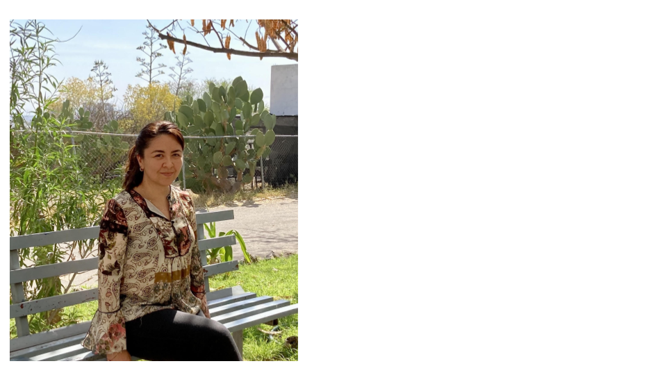
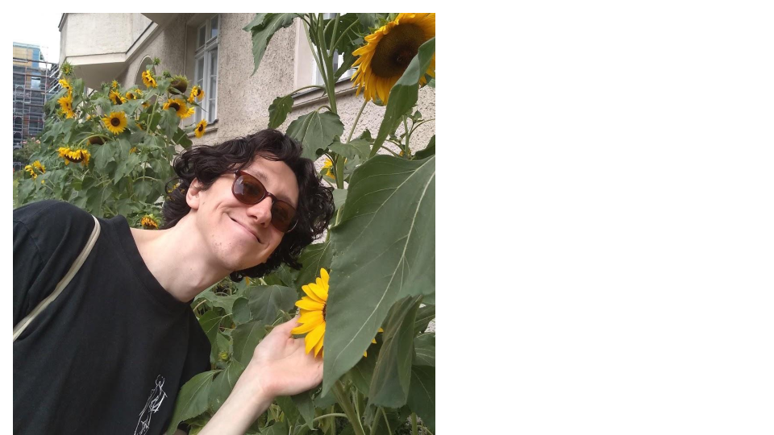
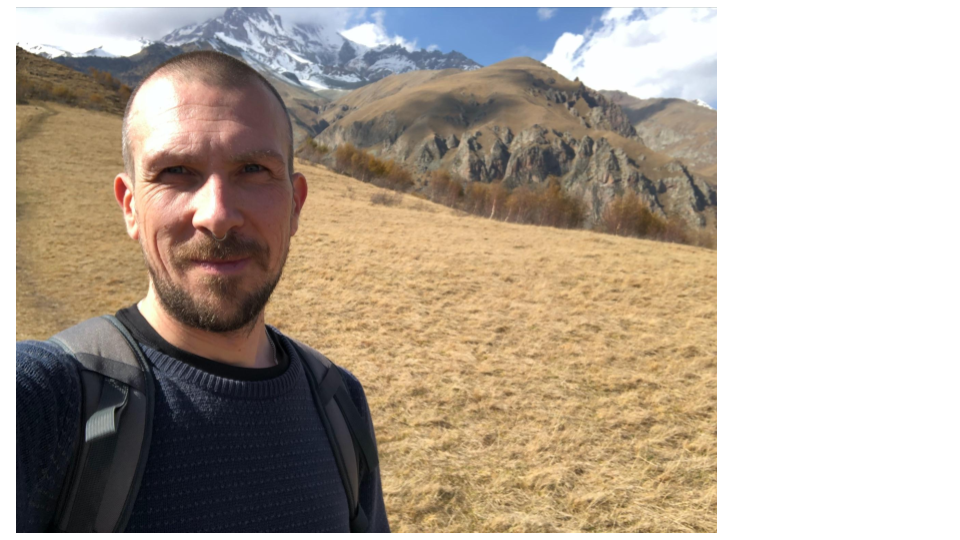
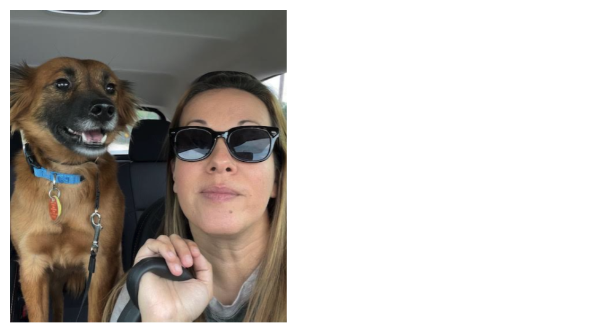
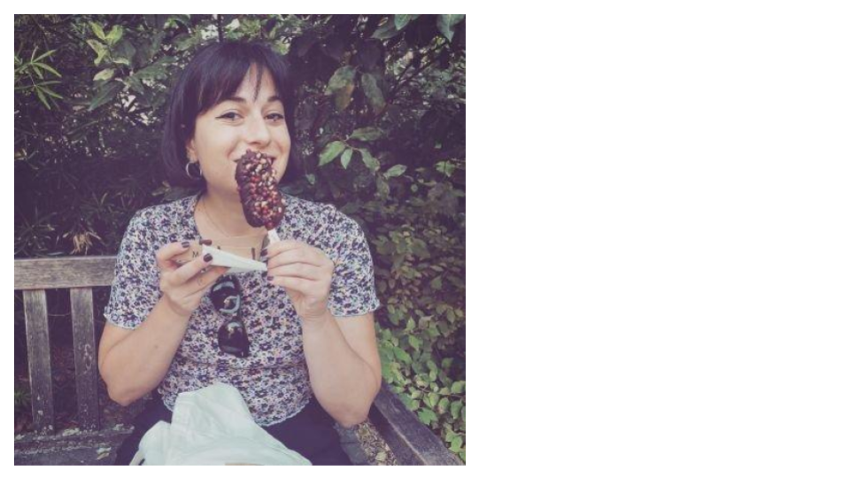
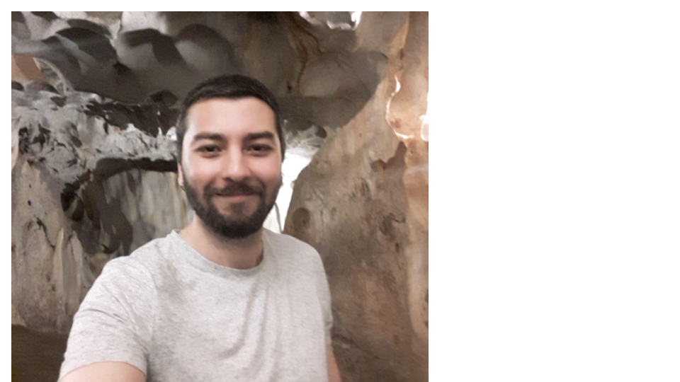
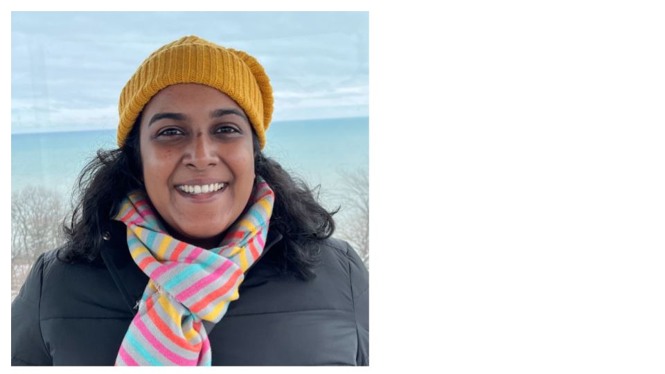

Hello all!

We, the Steering Committee of the SPAAM community would like to take a moment to introduce ourselves and give you all a quick idea of what we do.

First, what is the Steering Committee? This is a new organizing committee that was formed last year during the SPAAM4 conference. It is intended to guide the SPAAM community in a more formalized way; this involves brainstorming and proposing new initiatives and helping new initiatives get off the ground (like the successfully  launched SPAAMtisch), increasing engagement and support for SPAAM members and events, helping with ongoing organization efforts, publicization of SPAAM, and sourcing funds for the maintenance of SPAAM.

We all are volunteers on the Steering Committee and we are really excited to work with all of you and help improve the SPAAM community.

# The Steering Committee Members

## Miriam Bravo-Lopez (she/her) - Chair
I am a Mexican postdoctoral researcher at the International Laboratory for Human Genome Research (LIIGH), UNAM. My passion lies in exploring the evolutionary journey of ancient human pathogens using paleogenomics and paleoproteomics. I find solace hanging out with dogs, and when it comes to activities, running is my top pick.
Contact: mbravo@liigh.unam.mx, [**twitter**](http://twitter.com/MiriamJBravo1)

## Ian Light-Máka (he/him) - Secretary
I am a PhD student at the Max-Planck-Institute for Infection Biology in Felix Key’s lab. I study ancient pathogen evolution and emergence through a molecular evolution lens! I am also very interested in bioethics and spend lots of time making art.
Contact: light@mpiib-berlin.mpg.de, [**twitter**](http://twitter.com/ilight1542)

## Gunnar Neumann (he/him) - Treasurer
I am a PhD candidate in the department of archaeogenetics at the Max Planck Institute for Evolutionary Anthropology in Leipzig, Germany. My main research focuses are ancient pathogens and pathogen evolution. I love going to the theater, dance and art exhibitions, traveling, hiking and gardening.
Contact: gunnar_neumann@eva.mpg.de, [**twitter**](http://twitter.com/gunnar_neumann)

## Betsy (Elizabeth Nelson) (she/her) - Treasurer
I am a postdoc at the Institut Pasteur in Paris, France, and a faculty member of the Summer internship for INdigenous peoples in Genomics (SING) Canada. My research examines the emergence, evolution, and spread of infectious diseases in contexts marked by climatic, cultural, environmental, and socio-political transitions. I’m slightly obsessed with Logan Bean, dog-extraordinaire; But I also love making ceramics, gardening, hiking, and fishing. 
Contact: enelson@pasteur.fr, [**twitter**](http://twitter.com/eanelson42)

## Maria Lopopolo (she/her) - Social Media Team
I am a PhD student at the Institut Pasteur, Paris, France. I am interested in applying interdisciplinary approaches to the study of past populations from a genetic, anthropological, and metagenomic   point of view. My passions include ballet training, reading novels, roller skating, and Italian food.
Contact:  [**twitter**](http://twitter.com/Maria_Lopopolo), maria.lopopolo@pasteur.fr (email).

## Kadir Toykan Özdoğan (he/him)  - Social Media Team

I am a PhD student, working on sedimentary ancient DNA to investigate the lifestyle of the Roman Limes people as a part of the “Constructing the Limes” project. I am based at the Utrecht University and Wageningen University & Research. I love basketball, beer-tasting and science fiction!
Contact: k.t.ozdogan@uu.nl, [**twitter**](http://twitter.com/toykanozdogan)

## Aida Andrades Valtueña (she/her)  - Engagement Team
I am a postdoc at the Max Planck Institute for Evolutionary Anthropology working in the Computational Pathogenomics group. My main interest lies in pathogen emergence, dispersal and ecology and exploring new computational methods to make the most out of our little data! I am a passionate gardener, dog lover and a knitter.  
Contact: aida_andrades@eva.mpg.de, [**twitter**](http://twitter.com/aidaanva), @aidanva (slack)

## Shreya Ramachandran (she/her) - Engagement Team

I am a PhD student in Dr. Maanasa Raghavan’s lab at the University of Chicago. My research projects span a variety of topics in microbial evolution, from ancient pathogens to modern gut microbiomes. I am also interested in science teaching and communication. Outside of science I love trying new recipes, befriending other people’s dogs, and solving crossword puzzles (sometimes competitively). 
Contact: shreya23@uchicago.edu, [**twitter**](http://twitter.com/srama23)

# Roles:
- **Management team**: formed by the chair and the secretary. Responsible for ensuring the committee functions smoothly and achieves its goals.
- **Chair**: leads meetings, sets agendas, moderates discussions and delegates tasks to volunteer members. It represents the SPAAM community in any official meetings or interviews. They are also responsible for having an overview of the various initiatives by maintaining a close communication with the treasurer, social media and engagement teams. 
Allows for discussion around long-term topics, needs to be forward thinking on this end
- **Secretary**: Takes meeting minutes, sends them out via slack when they are ready, makes sure that assignments are noted. Organisational responsibilities (ie keeping google docs in order, annotating the minutes with required links, possibly doing same for the agenda ahead of time

- **Treasurer team**:
The treasurer team is responsible for managing the funds, for the communication related to funds and responsible for allocating funding to initiatives by serving as a line of communication between the organising committees and the Steering Committee. The treasurer team is also responsible to collect funds as well as finding grant opportunities to continue to fund SPAAM initiatives.

- **Social media team**:
The social media team is responsible for the outreach of the community, by tweeting, emailing as well as updating the website. Social media officers will announce new initiatives, conferences, papers and jobs that are relevant for the SPAAM community. They will also be responsible for maintaining the YouTube channel of the community.

- **Engagement team**: 
The engagement officers are responsible for coming up with new initiatives (projects, summer schools, outreach activities, etc.) and propose them to the community. They will also oversee ongoing initiatives and provide support for them to reach their goals. They will ensure that the initiative is known in the community, as well as outside the community together with the media team. As well as suggesting potential funding sources for the initiative, by engaging with the treasurer team.

# Events
- **SPAAM5**: Gathering in person happening on the 12 of September in Tartu (Estonia), the day before ISBA10. 
- **SPAAM Summer School**: Taking place online between the 31st-4th August 2023,the SPAAM Summer School is aimed towards Master and early-PhD students who want to get an introduction to Ancient Metagenomics. While registration has already passed, the teaching materials will be available online for free so keep your eyes open!
Hands-on workshop: Current developments in bioinformatic workflows applied to environmental ancient DNA data: A 5 days workshop focusing on processing and analysing environmental ancient DNA organized by . It is planned for February 26th to March 1st 2024 and the registration is open here!  

# Current initiatives
- **SPAAMTisch** (organisers: Maria Lopopolo, Biancamaria Bonucci, and Laura Carillo Olivas): this is an initiative that started the past 6 months and has already hosted 6 gatherings to discuss topics of relevance for the community or discuss papers/projects with the main authors! Discussion topics are decided based on polls posted in slack, and journal clubs with main authors dates are also announced in slack. Do not miss out and join dedicated channel #spaamtisch in slack!
- **SPAAM Blog** (organisers: Eleanor Joan Green and Shreya Ramachandran): this blog contains articles written by members of the community about any topic related to microbes, data analysis, etc. You can contribute a blog post or suggest a topic that you would like to see covered by contacting Eleanor or Shreya, but you can also just enjoy reading previous blog posts!
AncientMetagenomeDir (organisers: James Fellows Yates, Maxime Borry): a community effort to curate a github repository of standardised metadata for samples, studies, and libraries of aDNA sequencing. This resource helps make the reuse of data across studies easier than ever and has led to multiple publications.
- **MInAS** (organisers: James Fellows Yates, Antonio Fernández Guerra): a rich metadata is crucial for implementing FAIR (Findable, Accessible, Interoperable, Reusable) principles and enhancing the quality of research. It enables researchers to gain deeper insights into their own data as well as previously published data. 

# New initiatives
- **SPAAM Newsletter** (organisers: Steering Committee): We inaugurated with this email the SPAAM Newsletter! The steering committee will be sending out a quarterly newsletter containing information on new initiatives, ongoing initiatives, important events and papers relevant for the SPAAM community. If you want to announce anything to the community, let us know and we will include it!
- **The Little Book of Smiley Plots**: A collection of ancient DNA patterns and their causes (organisers: James Fellows Yates, Aida Andrades Valtueña): Ever got libraries that produced really weird damage patterns, but don't know what it means? Entering ancient DNA and don't know how all the different library preparation methods influence smiley plots? The SPAAM community is happy to announce a new collaborative project: The Little Book of Smiley Plots! The project aims to gather lots of standard, but also weird and wonderful damage profiles in one place with short descriptions to help ancient DNA researchers troubleshoot and debug their libraries! However, a book of scientific plots would be rather dry, wouldn't it? To make things light-hearted, as well as your scientific input, we are looking for your artistic skills too! We want each damage plot to have a companion caricature cartoon or picture with the weird and wonderful profiles creatively integrated into the image
So, have you ever generated strange damage plots? Do you want an excuse to be creative? Have a sneak peek at an early draft here of both plots and cartoons, then please join us in channel #little-book-smiley-plots to see how you can contribute to the book. If we reach a sufficient number of damage plots and artistic pictures, we hope to make the Little Books of Smiley Plots a citable publication!

- *Do you have an idea of a project you wanna start with the community? Reach out to the engagement officers and make it happen!*

# Papers (for the last 3 months)

[**Austin et al. Contamination source modeling with SCRuB improves cancer phenotype prediction from microbiome data. Nat Biotechnol (2023)**](https://doi.org/10.1038/s41587-023-01696-w)

[**De Sanctis, B. (2023). Phylogenetic inference using ancient environmental DNA**](https://doi.org/10.17863/CAM.95210)

[**Honap et al. Oral metagenomes from Native American Ancestors reveal distinct microbial lineages in the pre-contact era. American Journal of Biological Anthropology (2023)**](https://doi.org/10.1002/ajpa.24735)
 
[**Ventresca Miller, Wilkin, et al. Permafrost preservation reveals proteomic evidence for yak milk consumption in the 13th century. Commun Biol 6, 351 (2023)**](https://doi.org/10.1038/s42003-023-04723-3)

[**Piro, Renard. Contamination detection and microbiome exploration with GRIMER. Gigascience (2023)**](https://doi.org/10.1093/gigascience/giad017)

[**Kimsis et al. Tracing microbial communities associated with archaeological human samples in Latvia, 7-11th centuries AD. Environmental Biology (2023)**](https://doi.org/10.1111/1758-2229.13157)

[**Klapper, Hübner, Ibrahim et al. Natural products from reconstructed bacterial genomes of the Middle and Upper Paleolithic. Science (2023)**](https://doi.org/10.1126/science.adf5300)

[**Briscoe, Halperin, Garud. SNV-FEAST: microbial source tracking with single nucleotide variants. Genome Biol. 2023 Apr 30;24(1):101**](https://doi.org/10.1186/s13059-023-02927-8)

[**Bartholdy et al. Assessing the validity of a calcifying oral biofilm model as a suitable proxy for dental calculus. bioRxiv 2023.05.23.541904**](https://doi.org/10.1101/2023.05.23.541904)

[**Swali, P., Schulting, R., Gilardet, A. et al. Yersinia pestis genomes reveal plague in Britain 4000 years ago. Nat Commun 14, 2930 (2023)**](https://doi.org/10.1038/s41467-023-38393-w)

[**Rozwalak et al. Ultra-conserved bacteriophage genome sequence identified in 1300-year-old human paleofaeces. bioRxiv (2023)**](https://doi.org/10.1101/2023.06.01.543182)

[**Fernandez-Guerra et al. A 2-million-year-old microbial and viral communities from the Kap København Formation in North Greenland. bioRxiv (2023)**](https://doi.org/10.1101/2023.06.10.544454)

[**Whitmore et al. Inadvertent human genomic bycatch and intentional capture raise beneficial applications and ethical concerns with environmental DNA. Nat Ecol Evol 7, 873–888 (2023)**](https://doi.org/10.1038/s41559-023-02056-2)

[**Tian, Imanian.  VBCG: 20 validated bacterial core genes for phylogenomic analysis with high fidelity and resolution. bioRxiv (2023)**](https://doi.org/10.1101/2023.06.13.544823)

[**Neumann et al. Yersinia pestis im frühbronzezeitlichen Gräberfeld von Drasenhofen. Die derzeit ältesten Pesttoten Österreichs in ihrem kulturhistorischen Kontext. (Yersinia pestis in the Early Bronze Age Cemetery of Drasenhofen. The Currently Oldest Plague Deaths in Austria in their Cultural-Historical Context). Archaeologica Austriaca (2023)**](https://austriaca.at/bronzezeit-pest-in-drasenhofen)

# Announcements
We have a constitution! Read it [**here**](https://www.spaam-community.org/constitution/)

We have a new domain: **www.spaam-community.org**

# Job positions
- Professorship Zurich "One Health" Focus on Evolution/Paleogenetics (Deadline: 9 July 2023 ):[**link here**](https://jobs.uzh.ch/offene-stellen/assistenzprofessur-mit-tenure-track-fuer-one-health-mit-fokus-in-evolution/caeb33b3-b56b-4443-a7a9-272c56a8e2fb) 
- Staff scientist (bioinformatical analyses of ancient environmental genomes) (Deadline: 1 September 2023):[**link here**](https://candidate.hr-manager.net/ApplicationInit.aspx/?cid=1307&departmentId=19217&ProjectId=159394&MediaId=5&SkipAdvertisement=false)
- Postdoctoral Research Fellow – Ancient population genomics of dogs and wolves (Deadline: 15 July 2023):[**link here**](https://crick.wd3.myworkdayjobs.com/External/job/London/Postdoctoral-Fellow---Skoglund-Lab_R1188-1)

# **Wait for the next SPAAM 3 month-Newsletter!**

[**Mailing list for Standards, Precautions and Advances in Ancient Metagenomics | SPAAM**](https://spaam-community.github.io/)

- The list homepage [**here**](https://www.listserv.dfn.de/sympa/info/spaam-community) 

- General informations about mailing lists [**here**](https://www.listserv.dfn.de/sympa/help/introduction)

- To unsubscribe from this list, [**click here**](https://www.listserv.dfn.de/sympa/signoff/spaam-community)

---

---

### Steering Committee Members